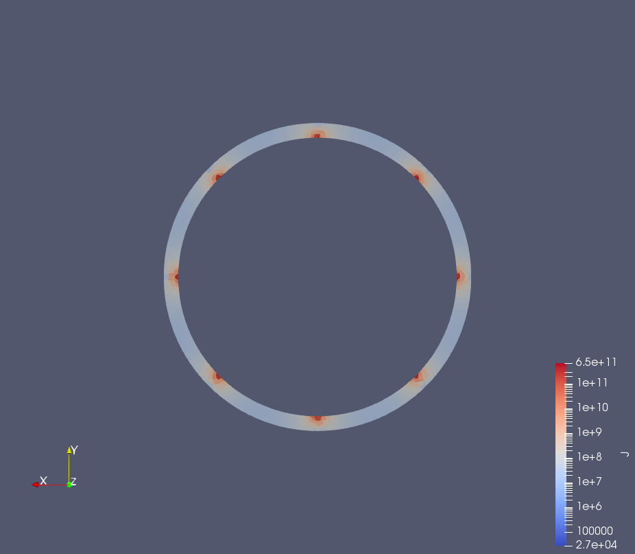

# Converting step to tetra mesh for EIDORS

Software used:

- Solidworks to make .step files
- [gmsh](https://gmsh.info/) to convert into tetraheadral FEM
- [Meshio](https://github.com/nschloe/meshio) to save as .vtu
- [meshio2matlab](https://github.com/Jimbles/meshio2matlab) to load .msh and .vtu into matlab
- [EIDORS](http://eidors3d.sourceforge.net/) for EIT calculations
- [Paraview](https://www.paraview.org/) to view .vtu files in 3D

## Simple single chamber

1. Run `MakeSensorMeshes.py` which converts `SensorChamber.STEP` to `SensorChamberSingle.STEP` and `SensorChamberSingle.VTU`

2. Run `Gmsh2Eidorsexample.m` which adds 8 electrodes in a ring in the centre and simulates a simple "adjacent" protocol. The current density is saved to a file `single_currentmag.vtu'` and the total sensitivity is saved to `single_J.vtu`.

3. view in paraview using the `.pvsm` 

## Thin walled chamber

As above using `MakeSensorMeshesThinWalled.py` and `Gmsh2EidorsexampleThinWalled.m`

